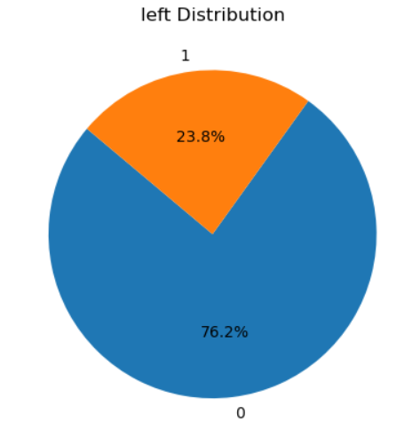
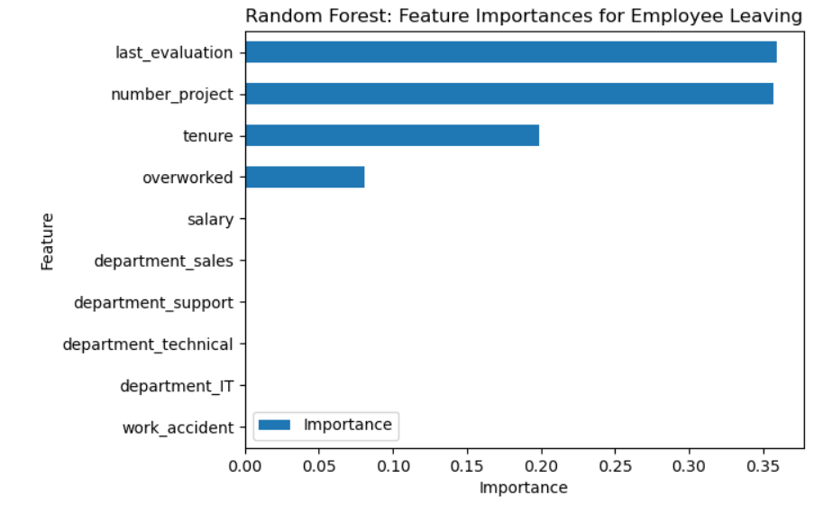

# Predicting_employee_left_HR
Use Logistic regression and tree-based model to predict whether or not an employee will leave the company.

## Overview
The goal of  this  project  was  to  analyze  the  data  collected  by  the  HR  department  and  to  build  a logistic regression and tree_based(decision tree and random forest model) to predict  whether  or  not  an  employee  will  leave  the  company.
After conducting feature engineering, the decision tree model achieved AUC of 93.8%, and accuracy of 96.2%, on the test set. The random forest modestly outperformed the decision tree model.
Based on the model, the last_evaluation,number_project,tenure,overworked have the highest importance. These variables are most helpful in predicting the outcome variable, left.

## Business Understanding
The HR department at Salifort Motors wants to take some initiatives to improve employee satis- faction levels at the company.If we can predict employees likely to quit, it might be possible to identify factors that contribute to their leaving. Because it is time-consuming and expensive to find, interview, and hire new employees, increasing employee retention will be beneficial to the company.

## Data Understanding
The dataset from HR consisted of 14,999  rows,  10  columns. 
A pie chart shows how many employees left and how many remained.
In connection to this, a feature was engineered to represent 
What are the main factors causing employees to leave?
Some suspected data leaks, data manipulation variables were dropped and reformatted into the proper data type.

## Modeling and Evaluation
A random forest was used to determine feature importance in whether or not an employee will leave the company.The plot right shows that in this random forest model, last_evaluation, number_project, tenure, and overworked have the highest importance, in that order.These variables are most helpful in predicting the outcome variable, left.The overall model achieved AUC of 93.8%, precision of 87.0%, recall of 90.4%, f1-score of 88.7%, and accuracy of 96.2%, on the test set. 

## Conclusion
The  models  and  the  feature  importances  extracted  from  the  models  confirm  that  employees  at  the company  are  overworked.To retain employees, measures should primarily be taken against overworked.Next step,It could be prudent to consider how predictions change when last_evaluation is removed from the data.
